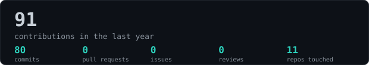
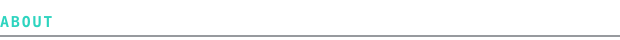
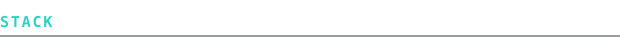
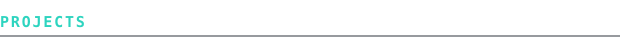
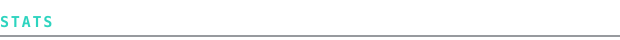
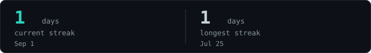
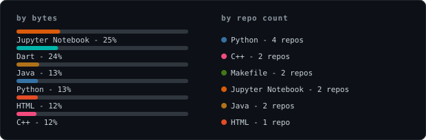
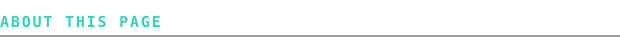

> Life's short. Take the risk, do the work.

<samp>python &nbsp; c++ &nbsp; java &nbsp; dart &nbsp; pytorch &nbsp; scikit-learn &nbsp; flutter &nbsp; firebase &nbsp; git</samp>

**[AI-Enhanced Phishing Detection](https://github.com/WendySpark/ai-enhanced-phishing-detection)** &nbsp;·&nbsp; <samp>python, pytorch, flask</samp> 
Hybrid BERT + CNN + Bi-LSTM + XGBoost model for detecting phishing emails, 
evaluated on held-out cross-corpus data. Ships with a Flask web app and SHAP explainability.

**[Mobile Tow Booking System](https://github.com/WendySpark/mobile-tow-booking-system)** &nbsp;·&nbsp; <samp>flutter, firebase, dart</samp> 
Role-based tow-booking prototype (Admin, User, Insurance Agent, Workshop) with 
real-time driver tracking, payment gating, and admin analytics.

**[AES Encryption](https://github.com/WendySpark/AES-encryption)** &nbsp;·&nbsp; <samp>c++</samp> 
AES-128 built from the S-box up - SubBytes, ShiftRows, MixColumns, key expansion - 
chained into a full encrypt/decrypt pipeline verified against the FIPS-197 known-answer test.

**[Risk Assessment Report](https://github.com/WendySpark/risk-assessment-report)** &nbsp;·&nbsp; <samp>security</samp> 
Full cybersecurity risk assessment for a fictional company: 20 identified risks 
across four assets, each matched with a countermeasure and implementation plan.

Every graphic on this page is generated, not embedded from anyone else's server.
`ascii.svg` is a photo pushed through a brightness-to-character ramp by
[`scripts/make_portrait.py`](scripts/make_portrait.py), run once by hand - the
source photo itself isn't committed. The stats graphics and these section
headings are drawn by [`scripts/generate_stats.py`](scripts/generate_stats.py)
straight from the GitHub GraphQL API, run daily by
[a scheduled action](.github/workflows/stats.yml) that commits only what changed.

Since nothing loads from a third party, nothing here can rate-limit or go dark.
Headings and stats use the viewer's own monospace font stack rather than an
embedded font, so this page stays a plain, dependency-free SVG pipeline.
